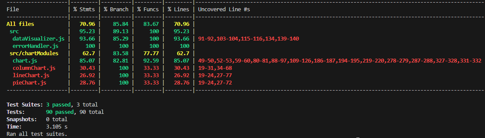

# Test Report

This report documents all the tests for this module/package.
The automatic tests are made using the `jest` framework.
The semi automatic/manual testing is made on a local server on the client/in the browser using html and js

## Latest Jest test report 30 September
The coverage is very good and I have tried to test the majority of functions/methods, I cannot figure out a way to test private methods independently using jest but they are in a way tested through the public/protected methods when they are tested since they call the private methods. It is hard to test the column-, line- and pie- chart classes with the automatic jest tests since they only have a few methods and they all change the internal HTMLCanvas element within its own class and never returns anything (and the element is created in the superclass Chart when creating an instance of the class). But I test them in my semi automatic/manual tests in my test application when testing the visual aspect of the module.


## ErrorHandler Tests

### `createErrorObject(string, string)` Automatic Tests
| Test Case |       Message      | Error Code |                                 Expected                                 | Status |
|-----------|--------------------|------------|--------------------------------------------------------------------------|--------|
|     1     | test error message |    403     | Instance of Error with message 'test error message' and status 403       |   ✅   |
|     2     | 12345              |    433     | Instance of Error with message undefined; status as 433                  |   ✅   |
|     3     | test error message |   '123'    | Instance of Error with message 'test error message'; status as undefined |   ✅   |
|     4     | test error message |   'test'   | Instance of Error with message 'test error message'; status as undefined |   ✅   |
|     5     | {}                 | undefined  | Instance of Error with message undefined and status undefined            |   ✅   |

### `consoleError(Error)` Automatic Tests
| Test Case |      Message       | Error Code |                Console Output              | Status |
|-----------|--------------------|------------|--------------------------------------------|--------|
|     1     | test error message |    403     | 'MESSAGE: test error message, STATUS: 403' |   ✅   |
|     2     |       12345        |    433     | 'STATUS: 433'                              |   ✅   |
|     3     | test error message |   '123'    | 'MESSAGE: test error message'              |   ✅   |
|     4     | test error message |   'test'   | 'MESSAGE: test error message'              |   ✅   |
|     5     |         {}         | undefined  | -                                          |   ✅   |


## DataVisualizer Tests

### `setGlobalOptions(Object)` Automatic Tests
error message for width = `#isOptionsCorrect: The width is not correctly formatted or missing, please provide a string with integers not starting with 0`

error message for height = `#isOptionsCorrect: The height is not correctly formatted or missing, please provide a string with integers not starting with 0`

error message for color = `#isOptionsCorrect: That color theme does not exist, choose: blue, green, red or yellow`

| Test Case | Color  | Width  | Height |   Expected Error Message   | Status |
|-----------|--------|--------|--------|----------------------------|--------|
| 1         | red    | 500    | 200    | undefined                  |   ✅   |
| 2         | green  | 1500   | 1200   | undefined                  |   ✅   |
| 3         | yellow | 400    | 600    | undefined                  |   ✅   |
| 4         | green  | 000    | 1200   | `error message for width`  |   ✅   |
| 5         | orange | 250    | 1000   | `error message for color`  |   ✅   |
| 6         | yellow | 234    | 222    | `error message for width`  |   ✅   |
| 7         | green  | 234    | 222    | `error message for height` |   ✅   |
| 8         | blue   | test   | test   | `error message for width`  |   ✅   |
| 9         | 2345   | 100    | 100    | `error message for color`  |   ✅   |
| 10        | red    | 500    | test   | `error message for height` |   ✅   |
| 11        | green  | test   | 500    | `error message for width`  |   ✅   |
| 12        | red    | 500    |        | `error message for height` |   ✅   |
| 13        | red    | test   |        | `error message for width`  |   ✅   |
| 14        | red    | 100    |        | `error message for width`  |   ✅   |
| 15        | color  | 500    |        | `error message for color`  |   ✅   |
| 16        | red    |        | 500    | `error message for width`  |   ✅   |
| 17        | red    |        | test   | `error message for width`  |   ✅   |
| 18        | red    |        | 100    | `error message for width`  |   ✅   |
| 19        | color  |        | 500    | `error message for color`  |   ✅   |
| 20        |        | 100    | 100    | `error message for color`  |   ✅   |
| 21        |        | test   | 100    | `error message for color`  |   ✅   |
| 22        |        | 100    | test   | `error message for color`  |   ✅   |
| 23        |        |        | test   | `error message for color`  |   ✅   |
| 24        |        |        | 150    | `error message for color`  |   ✅   |
| 25        |        | 100    |        | `error message for color`  |   ✅   |
| 26        |        | test   |        | `error message for color`  |   ✅   |
| 27        | red    | 100    | 100    | `error message for color`  |   ✅   |
| 28        |        |        |        | `error message for color`  |   ✅   |


### `createLineChart(Object)` Automatic Tests

Also tests the private method `#createChart(String, Object)` that also takes the global options for the class.
| Test Case | Options | DataPoints |         Expected        | Status |
|-----------|---------|------------|-------------------------|--------|
|    1      |   ✅    |    none    | return type = LineChart |   ✅   |
|    2      |   ✅    |    one     | return type = LineChart |   ✅   |
|    3      |   ✅    |  multiple  | return type = LineChart |   ✅   |


### `createColumnChart(Object)` Automatic Tests

Also tests the private method `#createChart(String, Object)` that also takes the global options for the class.
| Test Case | Options | DataPoints |         Expected          | Status |
|-----------|---------|------------|---------------------------|--------|
|    1      |   ✅    |    none    | return type = ColumnChart |   ✅   |
|    2      |   ✅    |    one     | return type = ColumnChart |   ✅   |
|    3      |   ✅    |  multiple  | return type = ColumnChart |   ✅   |


### `createPieChart(Object)` Automatic Tests

Also tests the private method `#createChart(String, Object)` that also takes the global options for the class.
| Test Case | Options | DataPoints |        Expected        | Status |
|-----------|---------|------------|------------------------|--------|
|    1      |   ✅    |    none    | return type = PieChart |   ✅   |
|    2      |   ✅    |    one     | return type = PieChart |   ✅   |
|    3      |   ✅    |  multiple  | return type = PieChart |   ✅   |

## Chart Tests

error message for data validity = `#isDataPointsValid: One or more datapoint value(s) is not the correct type, it should be a number.`

### `setColorTheme(str)` Automatic Tests

error message for color = `setColorTheme: That color theme does not exist, choose: blue, green, red or yellow`

Also tests the private method `#isColorValidType(str)`
| Test Case |   Input  |                 Expected                | Status |
|-----------|----------|-----------------------------------------|--------|
|     1     |  'blue'  | 'pass': _globalOptions.color = 'blue'   |   ✅   |
|     2     | 'green'  | 'pass': _globalOptions.color = 'green'  |   ✅   |
|     3     |  'red'   | 'pass': _globalOptions.color = 'red'    |   ✅   |
|     4     | 'yellow' | 'pass': _globalOptions.color = 'yellow' |   ✅   |
|     5     | 'orange' | `error message for color`               |   ✅   |
|     6     | 'purple' | `error message for color`               |   ✅   |
|     7     |   1234   | `error message for color`               |   ✅   |


### `insertDataPoint(str, int)` Automatic Tests

| Test Case |      Input     |             Expected            | Status |
|-----------|----------------|---------------------------------|--------|
|     1     | 'cats', 235    | 'pass': _dataPoints.cats = 235  |   ✅   |
|     2     | 'dogs', 150    | 'pass': _dataPoints.dogs = 150  |   ✅   |
|     3     | 'birds', 350   | 'pass': _dataPoints.birds = 350 |   ✅   |
|     4     | '1234', '100'  |  `error message data validity`  |   ✅   |
|     5     | 'test', 'test' |  `error message data validity`  |   ✅   |


### `updateDataPoint(str, int)` Automatic Tests

first insert a data point then update it.

| Test Case |   First Input  | Second Input |            Expected            | Status |
|-----------|----------------|--------------|--------------------------------|--------|
|     1     | 'cats', 235    | 'cats', 1    | 'pass': _dataPoints.cats = 1   |   ✅   |
|     2     | 'dogs', 150    | 'dogs', 1    | 'pass': _dataPoints.dogs = 1   |   ✅   |
|     3     | 'birds', 350   | 'birds', 1   | 'pass': _dataPoints.birds = 1  |   ✅   |
|     4     | '1234', '100'  |      -       | `error message data validity`  |   ✅   |
|     5     | 'test', 'test' |      -       | `error message data validity`  |   ✅   |


### `deleteDataPoint(str, int)` Automatic Tests

first insert a data point then delete it.

| Test Case |   First Input  | Second Input |                 Expected              | Status |
|-----------|----------------|--------------|---------------------------------------|--------|
|     1     | 'cats', 235    | 'cats', 235  | 'pass': _dataPoints.cats = undefined  |   ✅   |
|     2     | 'dogs', 150    | 'dogs', 150  | 'pass': _dataPoints.dogs = undefined  |   ✅   |
|     3     | 'birds', 350   | 'birds', 350 | 'pass': _dataPoints.birds = undefined |   ✅   |
|     4     | '1234', '100'  |      -       |     `error message data validity`     |   ✅   |
|     5     | 'test', 'test' |      -       |     `error message data validity`     |   ✅   |

### `setWidthTo(int)`

| Test Case | Input |               Expected              | Status |
|-----------|-------|-------------------------------------|--------|
|     1     |  100  | 'pass': _globalOptions.width = 100  |   ✅   |
|     2     |  350  | 'pass': _globalOptions.width = 350  |   ✅   |
|     3     |  20   | 'pass': _globalOptions.width = 20   |   ✅   |
|     4     |  2000 | 'pass': _globalOptions.width = 2000 |   ✅   |
|     5     |  -234 |   _globalOptions.width = undefined  |   ✅   |
|     6     |  2350 |   _globalOptions.width = undefined  |   ✅   |

### `setHeightTo(int)`

| Test Case | Input |               Expected              | Status |
|-----------|-------|-------------------------------------|--------|
|     1     |  100  | 'pass': _globalOptions.width = 100  |   ✅   |
|     2     |  350  | 'pass': _globalOptions.width = 350  |   ✅   |
|     3     |  20   | 'pass': _globalOptions.width = 20   |   ✅   |
|     4     |  2000 | 'pass': _globalOptions.width = 2000 |   ✅   |
|     5     |  -234 |   _globalOptions.width = undefined  |   ✅   |
|     6     |  2350 |   _globalOptions.width = undefined  |   ✅   |

### `clearChart()`

| Test Case |                 Input                 |          Expected         | Status |
|-----------|---------------------------------------|---------------------------|--------|
|     1     | Set multiple data points - then clear | 'pass': _dataPoints = {}  |   ✅   |

### `getCanvasElement()`
| Test Case |    Input    |                          Expected                          | Status |
|-----------|-------------|------------------------------------------------------------|--------|
|     1     | call method | The returned object to be an instance of HTMLCanvasElement |   ✅   |

### `getDataPoints()`
| Test Case |                      Input                      |                                          Expected                                         | Status |
|-----------|-------------------------------------------------|-------------------------------------------------------------------------------------------|--------|
|     1     | Set multiple data points - then call the method | The return object to be an Object, the corresponding data length that has been set before |   ✅   |

## Semi automatic/manual tests on the client.
In the test directory there is a index.html and index.js file present, 
these are there to test the module in the browser on the client by running it on a local server using vite.

### ColumnChart
The test is made in a loop with 10 different amounts of data point inputs:
- Tested by instantiating the ColumnChart class and binding it to a constant.
- Inserting it into the DOM.

**Result**: All 10 charts are inserted and displayed correctly

### LineChart
The test is made in a loop with 10 different amounts of data point inputs:
- Tested by instantiating the LineChart class and binding it to a constant.
- Inserting it into the DOM.

**Result**: All 10 charts are inserted and displayed correctly

### PieChart
The test is made in a loop with 10 different amounts of data point inputs:
- Tested by instantiating the PieChart class and binding it to a constant.
- Inserting it into the DOM.

**Result**: All 10 charts are inserted and displayed correctly

### Chart Class
Since all above mentioned classes are subclasses of the Chart class I decided to combine the testing of all the methods that are located in the superclass here.

#### Starting all tests.
All tests are started by instantiating a DataVisualizer class and creating one of the three charts like this, do the test and then getting the canvas element and appending it to the DOM body element:

```javascript
  const dataVisualizer = new DataVisualizer()
  const body = document.querySelector('body')

  const dataPoints = { one: 5, two: 10, three: 15, four: 20, five: 40, six: 22 }
  
  const chart = dataVisualizer.createLineChart(dataPoints) // or createColumnChart(dataPoints) or createPieChart(dataPoints)

  /* TEST */

  body.append(chart.getCanvasElement())
```

#### All public methods of the Chart Class:

--------------------------------------------
- `setColorTheme(string)`
The standard color theme is set to blue, so if nothing is set it will default to blue. The currently acceptable color themes are *red*, *green*, *blue* and *yellow*

**Expected**: The chart to become a green color.
**Result**: The chart changed to a green color theme.

```javascript
    chart.setColorTheme('green')
```

**Expected**: The chart to stay as the default/previously set color theme.
**Result**: The chart stayed as the default/previously set color.

```javascript
    chart.setColorTheme('purple')
    chart.setColorTheme(123)
```

--------------------------------------------
- `insertDataPoint(string, int)`

**Expected**: The chart to be updated visually with the new data point.
**Result**: The data point is successfully inserted into the chart.
```javascript
    chart.insertDataPoint('seven', 25)
```

--------------------------------------------
- `updateDataPoint(string, int, int)`

**Expected**: The data point 'one' with the value 5 to be update to get a value of 20.
**Result**: The data point is successfully updated.
```javascript
    chart.updateDataPoint('one', 5, 20)
```

**Expected**: The data point to not be updated (to avoid changing a datapoint with the same key name but with a different value)
**Result**: The data point is not changed.
```javascript
    chart.updateDataPoint('one', 20)
```

--------------------------------------------
- `deleteDataPoint(string, int)`

**Expected**: The data point to be deleted and not shown in the chart.
**Result**: The data point is successfully deleted.
```javascript
    chart.deleteDataPoint('three', 15)
```


--------------------------------------------
- `setHeightTo(int)`
The default height of the chart is 200 pixels.

**Expected**: The chart to go from 200 to 300 pixels high/tall.
**Result**: The chart is successfully changed to 300 pixels high.
```javascript
  chart.setHeightTo(300)
```

**Expected**: The chart to stay at 200 high/tall.
**Result**: The chart is not changed.
```javascript
  chart.setHeightTo('test')
```

--------------------------------------------
- `setWidthTo(int)`
The default width of the chart is 300 pixels.

**Expected**: The chart to go from 300 to 600 pixels wide.
**Result**: The chart is successfully changed to 300 pixels wide.
```javascript
    chart.setWidthTo(600)
```

**Expected**: The chart to stay at 300 wide.
**Result**: The chart is not changed.
```javascript
    chart.setWidthTo('test')
```

--------------------------------------------
- `clearChart()`

**Expected**: All data points are wiped from the chart leaving it empty.
**Result**: The chart is cleared from all data points.
```javascript
  chart.clearChart()
```

--------------------------------------------
- `getCanvasElement()`

**Expected**: To get an instance of a HTMLCanvasElement that is connected to the Chart class.
**Result**: Successfully gets a Canvas element with all the changes made through the Chart class applied to it.
```javascript
  const canvasElement = chart.getCanvasElement()
  console.log(canvasElement) // => <canvas height="200" width="300"></canvas> (some browser do not show the closing tag for canvas elements when there is no content inbetween but it is present)
```

--------------------------------------------
- `getDataPoints()`

**Expected**: To get all the data points that are currently present in the chart.
**Result**: Successfully gets all the data points as an object.
```javascript
const dataPoints = chart.getDataPoints()
console.log(dataPoints) // => { one: 5, two: 10, three: 15, four: 20, five: 40, six: 22 }
```

### DataVisualizer
Since the create methods are all tested at the start of each semi automatic/manual test I decided to only show the one unique method to the DataViualizer not mentioned in the other tests.

- `setGlobalOptions(obj)`

**Expected**: The color, width and height inserted to become the default for the charts.
**Result**: The color theme, width and height are correctly applied to the canvas elements.
The test:
```javascript
  const dataVisualizer = new Datavisualizer()

  options = {
    'color': 'red',
    'width': 400,
    'height': 600
  }

  dataVisualizer.setGlobalOptions(options)
```
